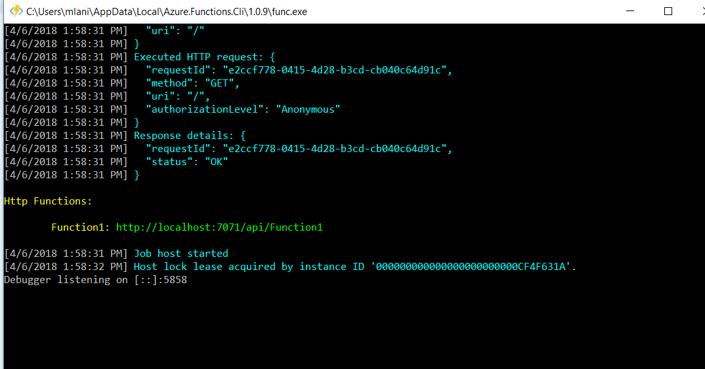

# Triggering Azure Data Factory (ADF) pipeline run from Logic Apps

In this article we will have a look on how you can initiate run of your Data Factory Pipeline from within Logic Apps. We assume you have your ADF pipeline created. For simple tutorial on how to create copy pipeline please see this page: https://docs.microsoft.com/en-us/azure/data-factory/quickstart-create-data-factory-copy-data-tool

ADF API requires Authentication header value to be present. This value contains AAD OAuth token. Logic apps provides simple way how to add AAD OAuth authentication to HTTP action, unfortunately it currently does not work with ADF API and so there is need to create custom Azure Function which can be invoked as an action within workflow defined in Logic App. In order to trigger ADF pipeline run from Logic App we need to perform following steps:

- **Create Azure AD application** which will be used for authentication when initiating REST request. 
- **Add created Azure AD app to list of contributors for ADF**
- **Create Azure Function** which will obtain **AAD OAuth token** using credentials obtained from create AAD application and will trigger pipeline run
- **Publish Function to Azure and add it to Logic App Pipeline**


## Create Azure AD application

In order to be able to obtain OAuth token used in further communication with ADF API we need to create AD application. Please follow this tutorial to create your AD application: https://docs.microsoft.com/en-us/azure/azure-resource-manager/resource-group-create-service-principal-portal#create-an-azure-active-directory-application 

Please follow also last step how to obtain **tenantID** as this will be necessary when obtaining token.

**Note**: When creating AAD application you can provide whatever application url, as this will not play any role in our case. 

## Add created Azure AD to contributor users of ADF

In order to allow clients authenticated using created AAD application to invoke ADF REST API, it is necessary to add AAD application to list of contributors within Role Based Access Control (RBAC) settings. You can achieve this by navigating to ADF blade, selecting *Users*, clicking *Add* button and selecting your AAD application you have create and assigning it role of Contributor:


## **Create Azure Function** triggering ADF pipeline run

In order to create Azure Function you need to have Azure Functions Tools for Visual Studio installed. To do so please follow this article: https://docs.microsoft.com/en-us/azure/azure-functions/functions-develop-vs 

To start Create new Functions Visual Studio project. In Function scaffolding wizard choose version v1 .NET Framework as Nuget packages we will be using are not available for .NET Standard yet, which is used in v2. Choose HTTP Triggered Function:


To implement authentication logic and ADF API invocation you need o install these Nuget Packages to your project:

- **Microsoft.IdentityModel.Clients.ActiveDirectory**
- **Microsoft.Azure.Management.DataFactory**

Bellow you can find code of the function. You should specify following parameters:

- **tenantId** id of your AAD tenant (available thru Active Directory Properties blade - as Directory ID )
- **applicationId** id of created AAD application
- **authenticationId** key/secret generated for your AAD application
- **subscriptionId** Id of your Azure subscription
- **resourceGroup** resource group name where your ADF is placed
- **dataFactoryName** name of ADF service
- **pipelineName** name of your pipeline

```C#
using System.Linq;
using System.Net;
using System.Net.Http;
using System.Threading.Tasks;
using Microsoft.Azure.Management.DataFactory;
using Microsoft.Azure.Management.DataFactory.Models;
using Microsoft.Azure.WebJobs;
using Microsoft.Azure.WebJobs.Extensions.Http;
using Microsoft.Azure.WebJobs.Host;
using Microsoft.IdentityModel.Clients.ActiveDirectory;
using Microsoft.Rest;

namespace RunADF
{
    public static class Function1
    {
        [FunctionName("Function1")]
        public static string Run([HttpTrigger(AuthorizationLevel.Function, "get", "post", Route = null)]HttpRequestMessage req, TraceWriter log)
        {
        	//Change those for your own values
            string tenantID = "";
            string applicationId = "";
            string authenticationKey = "";
            string subscriptionId = "";
            string resourceGroup = "";
            string dataFactoryName = "";
            string pipelineName = "";


            log.Info("C# HTTP trigger function processed a request.");

            var context = new AuthenticationContext("https://login.windows.net/" + tenantID);
            ClientCredential cc = new ClientCredential(applicationId, authenticationKey);
            AuthenticationResult result = context.AcquireTokenAsync("https://management.azure.com/", cc).Result;
            ServiceClientCredentials cred = new TokenCredentials(result.AccessToken);
            var client = new DataFactoryManagementClient(cred) { SubscriptionId = subscriptionId };

            CreateRunResponse runResponse = client.Pipelines.CreateRunWithHttpMessagesAsync(resourceGroup, dataFactoryName, pipelineName).Result.Body;
            return("Pipeline run ID: " + runResponse.RunId);
        }
    }
}

```

You can now run the project locally. After clicking start button Azure Function CLI will be started and you will be provided with localhost trigger address of your function. You can copy the address and navigate to it in browser and afterwards you can verify that your ADF pipeline was started.




## Publish Function to Azure and add it to Logic App Pipeline

In the last step we will add  Azure Function to Logic App workflow. In order to achieve that, we will first need to publish our function to Azure

### Publishing function to Azure.

You can create Azure Function App from portal and then deploy your code or you can create it from Visual Studio before publish. In this text we will describe second option.

Right click your project and choose publish. In displayed window choose *Create New* and hit *Publish*. 


As a next step provide information about your new Function App. Also create new *Consumption hosting plan* for your function. This will result into creation of hosting plan which will not have reserved computation resources but rather it will assign resources dynamically only when the function will be triggered. 

 

As a last step in publish process hit *Publish* button.


### Create Logic App Workflow with Azure Function Action

As a first step create Logic App with HTTP Trigger. Next click *Add action* and search for Az*ure Function Action*. In Action setting search for newly created Azure Function App


Next select specific function you want to run. By default name is Function1.


Then Save and Run workflow. You should see your Function to finish successfully and ADF pipeline should now be running.

For more details on Logic Apps please see documentation: https://docs.microsoft.com/en-us/azure/logic-apps/ 

On this page you can find other actions that may be invoked thru ADF REST API: https://docs.microsoft.com/en-us/azure/data-factory/quickstart-create-data-factory-dot-net#create-a-pipeline-run